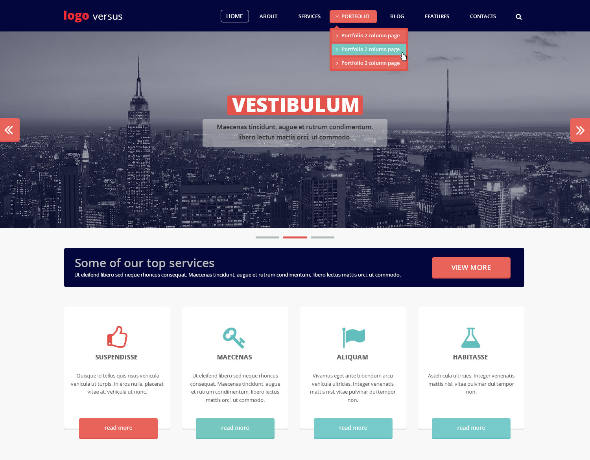

##Описание задания и требования:
 

+ Отверстать макет, кроссбраузерно и адаптивно;
+ Меню должно ховерится как на макете;
+ Поиск раскрываться, не ломая верстку;
+ Слайдер работать автоматически, и перелистываться при клике на стрелки.(JavaScript, jQuery, без использования библиотек).
+ Использовать стандартную верстку, без использования фреймворков.